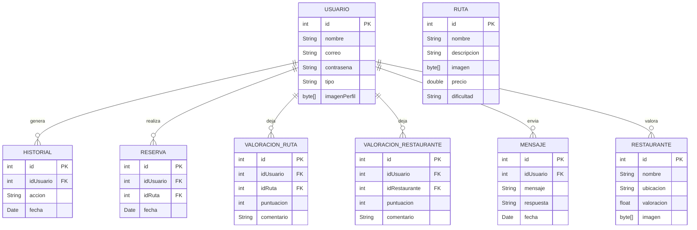

# 🏔️ AsturTerra - Sistema de Gestión de Turismo en Asturias

Este es un **sistema de gestión de turismo** desarrollado en **Java (Swing) con MySQL** para gestionar rutas turísticas, reservas, valoraciones, restaurantes y comunicación con soporte.

---

# 📌 **Características Principales**
✅ Registro e inicio de sesión de usuarios (Clientes / Administradores).  
✅ CRUD de **Rutas** con imágenes, precios y niveles de dificultad.  
✅ CRUD de **Actividades y Restaurantes** con valoraciones.  
✅ **Reservas y cancelaciones** de rutas.  
✅ Sistema de **Valoraciones** de rutas y restaurantes.  
✅ **Chat en tiempo real** entre usuarios y administradores.  
✅ Registro de **Historial de actividades** de los usuarios.  
✅ **Exportación de datos** a **PDF y Excel**.  
✅ **Modo oscuro/claro** para la interfaz gráfica.  

---

# 📂 **Estructura del Proyecto**
📁 TurismoAsturias  
├── 📂 src  
│ ├── 📂 config → Conexión a la base de datos  
│ ├── 📂 dao → Acceso a la base de datos (CRUD)  
│ ├── 📂 modelo → Clases de datos (Usuario, Ruta, Reserva, etc.)  
│ ├── 📂 vista → Interfaces gráficas (Swing)  
│ ├── 📂 controlador → Lógica de negocio  
├── 📂 assets → Imágenes de prueba  
├── 📜 README.md → Documentación del proyecto  
├── 📜 TurismoAsturias.sql → Base de datos MySQL  

# 📜 **Diagrama de Clases**

```mermaid
classDiagram

%% ========== MODELOS ==========
class Usuario {
  +int id
  +String nombre
  +String correo
  +String contrasena
  +String tipo
  +byte[] imagenPerfil
}

class Ruta {
  +int id
  +String nombre
  +String descripcion
  +byte[] imagen
  +double precio
  +String dificultad
}

class Restaurante {
  +int id
  +String nombre
  +String ubicacion
  +float valoracion
  +byte[] imagen
}

class Reserva {
  +int id
  +int idUsuario
  +int idRuta
  +Date fecha
}

class Historial {
  +int id
  +int idUsuario
  +String accion
  +Date fecha
}

class Mensaje {
  +int id
  +int idUsuario
  +String mensaje
  +String respuesta
  +Date fecha
}

class ValoracionRuta {
  +int id
  +int idUsuario
  +int idRuta
  +int puntuacion
  +String comentario
}

class ValoracionRestaurante {
  +int id
  +int idUsuario
  +int idRestaurante
  +int puntuacion
  +String comentario
}

%% ========== DAO ==========
class UsuarioDAO
class RutaDAO
class RestauranteDAO
class ReservarDAO
class HistorialDAO
class MensajeDAO
class ValoracionDAO

%% ========== SERVICE ==========
class TurismoService {
  +Usuario iniciarSesion()
  +boolean registrarUsuario()
  +List<Ruta> obtenerRutas()
  +boolean reservarRuta()
  +List<Historial> obtenerHistorialUsuario()
  +Restaurante obtenerRestaurantePorNombre()
  +boolean valorarRuta()
  +boolean valorarRestaurante()
  +List<Mensaje> obtenerMensajesUsuario()
}

%% ========== VISTAS ==========
class Login {
  -JTextField txtCorreo
  -JPasswordField txtContraseña
  -JButton btnLogin
  -JButton btnRegistro
}

class Registro {
  -JTextField txtNombre
  -JTextField txtCorreo
  -JPasswordField txtContraseña
  -JCheckBox chkAdmin
  -JButton btnRegistrar
  -File imagenPerfil
}

class MenuPrincipal {
  -Usuario usuario
  -JPanel panelRutas
  -JPanel panelReservas
  -JPanel panelRestaurantes
  -JPanel panelHistorial
  -JPanel panelChat
}

class VistaRutas {
  -Usuario usuario
  -JTable tablaRutas
  -DefaultTableModel modeloTabla
}

class VistaRestaurantes {
  -Usuario usuario
  -JList listaRestaurantes
  -JLabel lblImagen
}

class VistaReservas {
  -Usuario usuario
  -String rutaSeleccionada
  -JList listaReservas
}

class VistaHistorial {
  -Usuario usuario
  -JList listaHistorial
}

class VistaChat {
  -Usuario usuario
  -JTextArea txtMensajes
}

class VistaValoraciones {
  -int idRuta
  -JComboBox cmbPuntuacion
  -JTextArea txtComentario
}

class ValorarRestaurantes {
  -int idRestaurante
  -Usuario usuario
  -JComboBox cmbPuntuacion
}

class AgregarRuta {
  -JTextField txtNombre
  -JTextField txtDescripcion
  -JTextField txtPrecio
  -JComboBox cmbDificultad
}

class AgregarRestaurante {
  -JTextField txtNombre
  -JTextField txtUbicacion
  -JSpinner spnValoracion
  -File imagenPerfil
}

%% ========== RELACIONES DE SERVICIO ==========
TurismoService --> UsuarioDAO
TurismoService --> RutaDAO
TurismoService --> RestauranteDAO
TurismoService --> ReservarDAO
TurismoService --> HistorialDAO
TurismoService --> MensajeDAO
TurismoService --> ValoracionDAO

%% ========== DAO - MODELO ==========
UsuarioDAO --> Usuario
RutaDAO --> Ruta
RestauranteDAO --> Restaurante
ReservarDAO --> Reserva
HistorialDAO --> Historial
MensajeDAO --> Mensaje
ValoracionDAO --> ValoracionRuta
ValoracionDAO --> ValoracionRestaurante

%% ========== VISTAS - MODELOS ==========
Login --> Usuario
Registro --> Usuario
MenuPrincipal --> Usuario
VistaRutas --> Ruta
VistaRutas --> Usuario
VistaRestaurantes --> Restaurante
VistaRestaurantes --> Usuario
VistaReservas --> Reserva
VistaReservas --> Usuario
VistaHistorial --> Historial
VistaHistorial --> Usuario
VistaChat --> Mensaje
VistaChat --> Usuario
VistaValoraciones --> ValoracionRuta
VistaValoraciones --> Usuario
ValorarRestaurantes --> ValoracionRestaurante
ValorarRestaurantes --> Usuario
AgregarRuta --> Ruta
AgregarRestaurante --> Restaurante

%% ========== VISTAS - TURISMOSERVICE ==========
Login --> TurismoService
Registro --> TurismoService
VistaRutas --> TurismoService
VistaReservas --> TurismoService
VistaHistorial --> TurismoService
VistaChat --> TurismoService
VistaValoraciones --> TurismoService
ValorarRestaurantes --> TurismoService
VistaRestaurantes --> TurismoService
    
```


# 📜 **Diagrama casos de uso**

```mermaid

```
# 📜 **Diagrama ER**


---
# 🛠️ **Instalación y Configuración**

## 📌 **1. Clonar el repositorio**
```bash
git clone https://github.com/Pablirry/TurismoAsturias.git

```
## 📌 **2. Configurar la base de datos**

### 1. Importar el archivo TurismoAsturias.sql en MySQL:
```bash
CREATE DATABASE turismo_asturias;
USE turismo_asturias;
SOURCE TurismoAsturias.sql;
```

### 2. Configurar la conexión en src/config/ConexionBD.java:
```bash
private static final String URL = "jdbc:mysql://localhost:3306/turismo_asturias";
private static final String USER = "root";
private static final String PASSWORD = "tu_contraseña";
```

## 📌 **3. Compilar y ejecutar el proyecto**
Abrir el proyecto en Eclipse o NetBeans.  
Asegurar que los drivers JDBC para MySQL están configurados.  
Ejecutar la clase Main.java para iniciar la aplicación.

### 📸 Capturas de Pantalla
📍 Menú Principal  
📍 Gestión de Rutas  
📍 Reservas y Valoraciones  
📍 Modo Oscuro y Exportación de Datos  

(Se agregarán imágenes después de la implementación completa de las vistas)  

### 🧑‍💻 Tecnologías Utilizadas
<table> <tr> <td align="center"><br>Java (Swing)</td> <td align="center"><br>MySQL</td> <td align="center"><br>GitHub</td> </tr> <tr> <td align="center"><br>JDBC</td> <td align="center"><br>Apache POI</td> <td align="center"><br>iText (PDF)</td> </tr> </table> 

### 📩 Contacto y Soporte
Si tienes alguna pregunta o sugerencia, contacta a:  
📧 pablolopezruiz1@gmail.com  
🔗 GitHub: Pablirry
